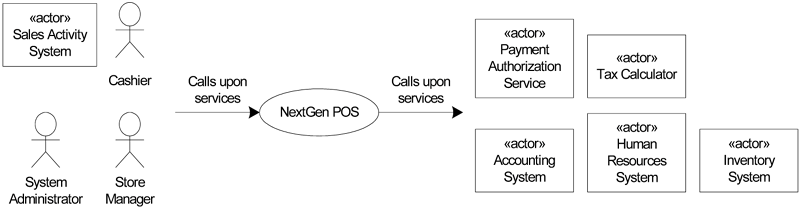

## 设想

### 修订历史

|   版本   |     日期      |                 描述                 | 作者 |
| :------: | :-----------: | :----------------------------------: | :--: |
| 初始草案 | 2021年1月18日 | 第一个草案。主要在细化阶段中进行精华 | sun  |
|          |               |                                      |      |

### 简介

我们设想NextGen POS是下一代POS应用，能够容错，具有灵活性以支持各种客户的不同业务规则，具有多终端和用户接口机制，并且能够与各种第三方支持系统进行整合。

### 定位

1. 商业机遇

   就各种业务规则和网络设计而言（例如，瘦客户端或其他；两层、三层或四层架构），现有的POS产品无法适应客户的业务。此外，在业务和终端增长时，现有产品不能很好地扩展。而且，这些产品无法同时以在线和离线模式工作，不能动态地根据错误进行调整。现有产品都无法方便地与大量第三方系统集成。它们都不能采用新的终端技术，例如移动PDA。以上这些不灵活的情形无法满足市场的需要，因此需要一种POS来改变这种情形。

2. 问题综述

   传统的POS系统灵活性、容错性差，并且难以与第三方系统集成。这就带来诸多问题，包括无法快速完成销售流程、无法加入软件不支持的处理过程以及不能支持及时准确的账务和库存数据管理。这些问题会影响收银员、商店经理、系统管理员和企业管理人员。

3. 产品定位综述

   - 简洁地概括系统目标用户、出众的特性和与竞争者的差异。

4. 选择和竞争......

### 涉众描述

1. 市场统计......

2. 涉众（非用户）概要......

3. 用户概要......

4. 涉众的关键高阶目标及问题

   通过专题专家和其他涉众参加的为期一天的需求讨论会，和对一些零售店的调查，得出一下关键目标和问题：

| 高阶目标                   | 优先级 | 相关问题                                                     | 当前解决方案                                            |
| :------------------------- | :----- | :----------------------------------------------------------- | :------------------------------------------------------ |
| 快速、健壮和整合的销售流程 | 高     | 负载增加时速度降低 如果有构件故障，则无法完成销售过程 由于没有和现有的账务、库存和人力资源系统整合，所以缺乏来自这些系统的及时准确的信息。因此难以进行统计和计划 不能为特殊的业务需求定制业务规则 难以增加新的终端或用户接口类型（例如移动PDA） | 现有的POS产品提供了基本的销售过程，但是没有解决这些问题 |
| ......                     | ...... | ......                                                       | ......                                                  |

5. 用户级目标

   用户（和外部系统）要求系统实现以下目标：

   - 收银员：处理销售交易、处理退货、入款、出款
   - 系统管理员：管理用户、安全性和系统表
   - 经理：启动和关闭
   - 销售活动系统：分析销售数据
   - ......

6. 用户环境......

### 产品概览

1. 产品展望

   NextGen POS系统通常安装在商店中。如果使用移动终端，则可以在商店网络邻近的封闭区域内使用，包括商店内部或外部的封闭区域。系统能够与其他系统协作，为用户提供各种服务，如图“设想-1”所示。

2. 优点概述

| 支持的特性                                                   | 涉众利益                                                     |
| ------------------------------------------------------------ | ------------------------------------------------------------ |
| 从功能上说，系统能够提供销售组织需要的常见服务。包括记录销售、支付授权、退货处理等 自动检测错误，将无效服务切换到本地离线处理过程 在销售处理中的不同场景点可以插入业务规则 使用行业标准系统以，与第三方系统进行实时交易  ....... | 自动化、快速POS服务  当外部构件发生故障时继续销售处理过程 灵活的业务逻辑配置 提供及时、准确的销售、账务和库存信息，以支持统计和计划 ...... |

3. 假设和依赖......

4. 成本和定价......

5. 许可和安装

### 系统特性概要

- 记录销售交易
- 支付授权
- 对用户、安全性、编码和约束表等进行系统管理
- 当外部构件发生故障时，自动进行离线销售处理
- 基于行业标准，与第三方系统进行实时交易，这些第三方系统包括库存、账务、人力资源、税金计算器和支付授权服务等
- 在处理场景中固定、公共的设定点定义和执行定制的“可插拔”业务规则。
- .......

### 其他需求和约束

包括设计约束、可用性、可靠性、性能、可支持性、设计约束、文档、包装等。参加补充性规格说明和用例。

