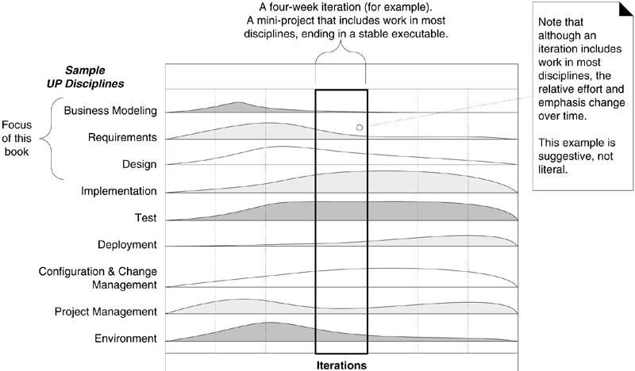

## 《UML和模式应用》(*Applying UML and Patterns*) 中的例子

> 整本书围绕`Monopoly Game`和`NextGen POS`两个示例来介绍UML在实际项目中的使用，使用了UP。

> 书的副标题 -- 面向对象分析与设计及迭代开发简介（An Introduction to Object-Oriented Analysis and Design and Iterative Development）真实反映了本书的内容，而正标题。。。

这里把书中的两个例子的各种文档和UML模型整合了一下。

### 说明

- Monopoly Game和NextGen POS目录都是maven项目的目录，使用IDE打开，推荐Vscode或者IDEA。

- doc目录内是相关的文档。

- mdj文件是UML模型文件，用StarUML4打开（下载地址：https://staruml.io/download/releases-v4/StarUML%20Setup%204.0.0.exe）。
- md文件是markdown语法文件，找支持markdown语法的编辑器打开即可，推荐[Typora](https://typora.io/)。

## 关于UP（敏捷过程）

### UP desciplines

### UP制品及其创建时限

（s：开始，r：精化）

| 科目（disciplines） | 实践                                                   | 制品                                               | 初始                   | 细化                   | 构造           | 移交 |
| ------------------- | ------------------------------------------------------ | -------------------------------------------------- | ---------------------- | ---------------------- | -------------- | ---- |
| 业务建模            | 敏捷建模 需求讨论会                               | 领域模型                                           |                        | s                      |                |      |
| 需求                | 需求讨论会 设想包装练习 记点投票表决         | 用例模型 设想 补充性规格说明 词汇表 | s s s s | r r r r |                |      |
| 设计                | 敏捷建模 测试驱动开发                             | 设计模型 软件架构文档 数据模型           |                        | s s s        | r  r |      |
| 实现                | 测试驱动开发 结对编程 持续集成 编码标准 |                                                    |                        |                        |                |      |
| 项目管理            | 敏捷项目管理 Scrum每日例会                        |                                                    |                        |                        |                |      |

### UP制品关系图

